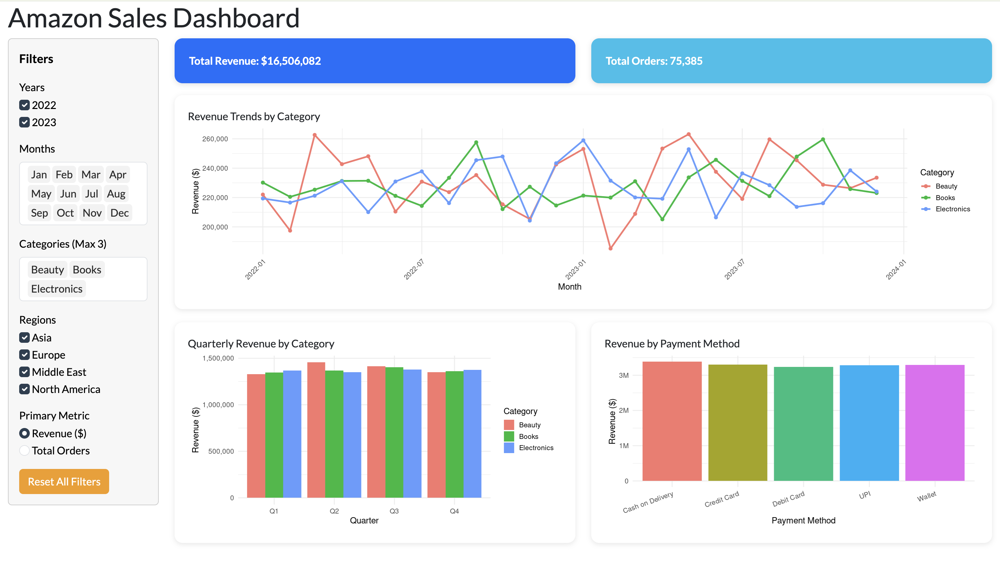

# Amazon Sales Dashboard (Shiny)



[]()
[]()

🔗 **Live Dashboard:**  
https://eduardorasanmar-dsci-532-amazon-sales-shiny-r.share.connect.posit.cloud

An interactive **R Shiny dashboard** for exploring Amazon sales data across time, product categories, regions, and payment methods.  
The dashboard enables users to dynamically filter the data and analyze sales performance using interactive visualizations.

---

## Dashboard Preview


---

## Key Features

- Interactive filtering by **Year, Month, Category, and Region**
- Toggle between **Revenue ($)** and **Total Orders**
- **Monthly revenue trends by product category**
- **Quarterly revenue comparison**
- **Revenue breakdown by payment method**
- **Reset filters** to quickly return to the default view

---

## Technology Stack

This project was built using:

- **R**
- **Shiny**
- **ggplot2**
- **dplyr**
- **lubridate**
- **scales**
- **bslib**

Deployment was done using **Posit Connect Cloud**.

---

## Running the App Locally

Clone the repository and install required packages:

```r
install.packages(c(
  "shiny",
  "dplyr",
  "ggplot2",
  "readr",
  "lubridate",
  "scales",
  "bslib"
))
```

Then run the application:

```r
shiny::runApp()
```